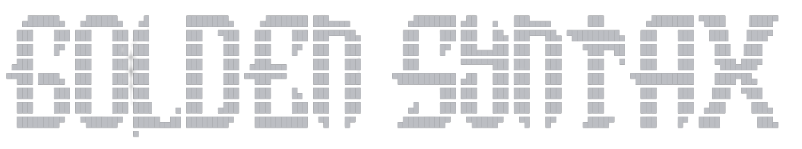
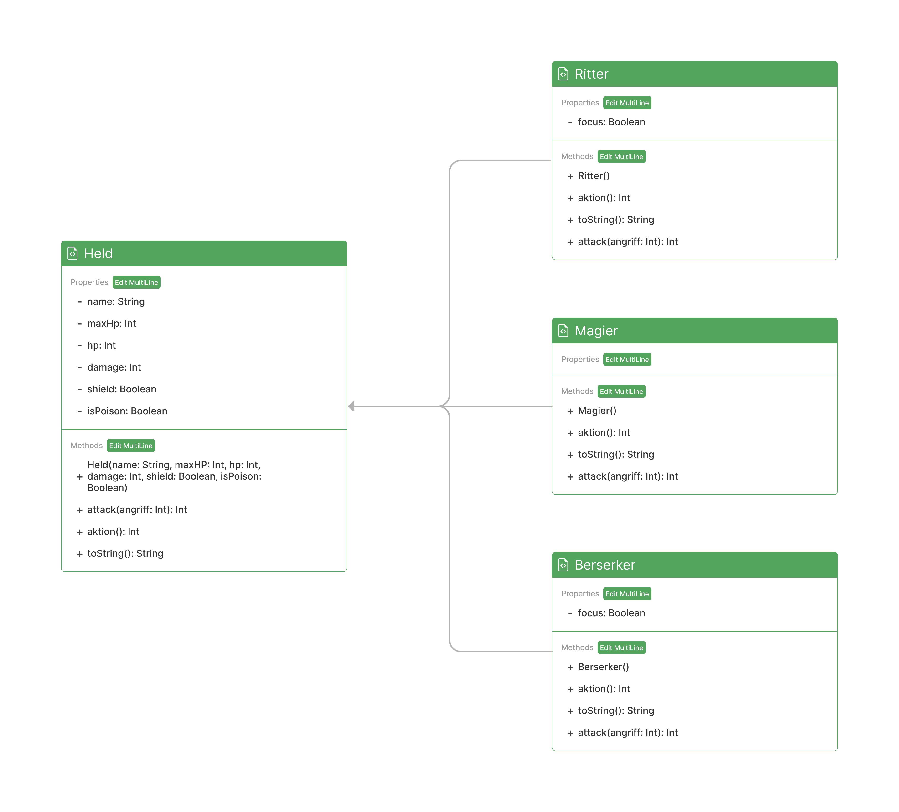
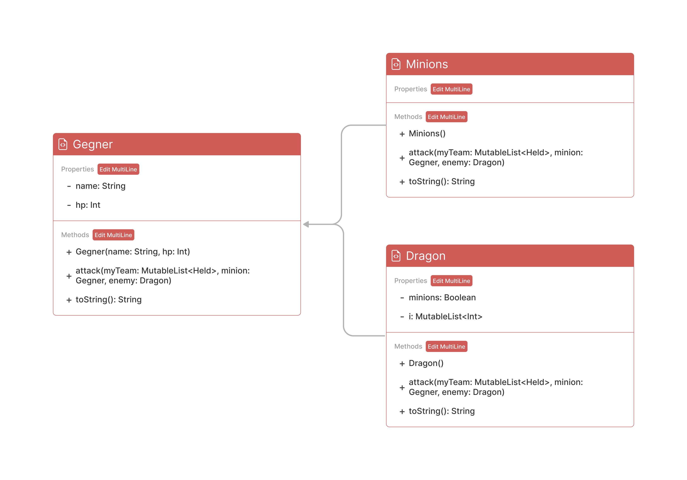

---
Hierbei handelt sich um ein kleines Spiel, 
in dem man mit einem selbst zusammengestellten Team
genen einen Drachen kämpft. Der Kampf ist runden basiert.

### 
Wie läuft das Spiel ab?

---
Die Navigierung erfolgen über die Konsole, indem man durch die
Eingabe einer Zahl jeweils durch die Menüs navigiert. Du beginnst
damit dir ein Team aus jeweils 3 Helden verschiedener Klassen
(Ritter, Magier, Berserker) auszuwählen. Schon startet die erste
Runde und du kannst je Held in deinem Team eine Aktion ausführen.
Haben alle deine Helden eine Aktion durchgeführt ist der Drache dran.
Dieser greift je nach Skill eines deiner Helden an, beschwört Minions
oder greift alle Helden auf einmal an. Die Runden werden wiederholt
bis du den Drachen besiegst oder der Drache dein Team vernichtet.

### 
Klassendiagramme

---

Klassen der Helden

 Die einzelnen Helden erben von der Oberklasse Held.
  

Klassen der Gegner

 Die einzelnen Gegner erben von der Oberklasse Gegner.
 

### 
Skills & Stats

---

### Helden
*Der User hat die Möglichkeit jede Runde die Aktion für jeden einzelnen Helden zu setzen.*

###### Skills

<u>Magier</u>

* Feuersturm -> trifft ein Gegner mit einem random Schaden
* Spiralschlag -> trifft einen Gegner mit einem random Schaden
* Heilen -> Heilt alle aus dem Team inklusive sich  (Vorausgesetzt HP > 0)
* Schild -> erleidet kein Schaden | sobald getroffen = reset 

<u>Ritter</u>

* Schwerthieb -> trifft ein Gegner mit einem random Schaden
* Spiralschlag -> trifft ein Gegner mit einem random Schaden
* Fokus -> lädt einen Schlag +Damage beim nächsten Angriff
* Schild -> erleidet kein Schaden | sobald getroffen = reset

<u>Berserker</u>

* Hieb -> trifft ein Gegner mit einem random Schaden
* Tausend Dolche -> trifft ein Gegner mit einem random Schaden
* Fokus -> lädt einen Schlag +Damage beim nächsten Angriff
* Schild -> erleidet kein Schaden | sobald getroffen = reset

###### Stats

| Char      | HP  | Damage | 
|-----------|-----|--------|
| Berserker | 110 | 60-190 |
| Ritter    | 150 | 20-160 |
| Magier    | 100 | 30-90  |

### Gegner
*Die Gegner greifen alle mit random Angriffen an, die jede Runde neu gesetzt werden.*

###### Skills

<u>Drache</u>

* Schwarze Flamme -> trifft einen Helden mit einem random Schaden
* Felswurf -> trifft einen Helden mit einem random Schaden
* Heilung -> heilt sich selbst
* Eisatem -> trifft alle Helden mit einem random Schaden
* Giftwolke -> trifft einen Helden, zieht solange 10% von maximalen HP ab, bis Held nur noch 20% vom maximalen HP hat
* Beschwörung -> beschwört 3 Minions (nur 1x pro Spiel möglich)

<u>Minions</u>

* Schubser -> trifft einen Helden mit einem random Schaden
* Stockschlag -> trifft einen Helden mit einem random Schaden
* Peitsche -> trifft einen Helden mit einem random Schaden
* Steinwurf -> trifft einen Helden mit einem random Schaden

###### Stats

| Char   | HP   | Damage | 
|--------|------|--------|
| Drache | 4000 | 40-120 |
| Minion | 800  | 5-60   |

